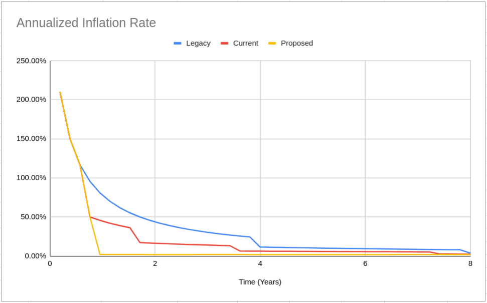

# CCIP-012

## Preamble

| CCIP Number   | 012                                     |
| ------------- | --------------------------------------- |
| Title         | Stabilize Emissions and Treasuries      |
| Author(s)     | Jason Schrader jason@joinfreehold.com   |
|               | BowTiedMooneeb bowtiedmooneeb@gmail.com |
|               | Ryan Waits ryan.waits@gmail.com         |
| Consideration | Economic, Governance, Technical         |
| Type          | Standard                                |
| Status        | Draft                                   |
| Created       | 2022-08-04                              |
| License       | BSD-2-Clause                            |
| Replaces      | CCIP-010                                |

## Introduction

This proposal implements the first of two changes to help stabilize the CityCoins protocol design, allowing for future development, experimentation, and growth.

Please see CCIP-013[^1] for the second part of the proposal.

This proposal is divided into two phases:

- Phase 1: reduce current CityCoin emissions to 2%
- Phase 2: move treasuries to smart contract vaults

## Specification

### Phase 1: Reduce CityCoin Emissions

Previously, the community successfully voted for and implemented CCIP-008 in April 2022[^2]. This change included a single iteration to test stemming the miner arbitrage problem, the results were mixed as the arbitrage volume was reduced, but is still persistent[^3].

Phase 1 change reduces inflation to 2% annually for existing CityCoins, and works in concert with proposed changes described in Phase 3 and Phase 4 included in CCIP-013[^1].

To implement this change a proposal will be submitted to the auth contract for MIA/NYC, using the `update-coinbase-amounts` function defined in CCIP-010[^4].

The coinbase amounts will be updated based on the schedule described in the supplemental spreadsheet[^5], with a visual example of the reduction in total supply below:



The epochs and coinbase thresholds will remain the same, such that:

| Epoch | Legacy/Current Block Reward | Proposed MIA Reward | Proposed NYC Reward |
| ----- | --------------------------- | ------------------- | ------------------- |
| 0     | 250,000                     | 250,000             | 250,000             |
| 1     | 100,000                     | 100,000             | 100,000             |
| 2     | 50,000                      | 50,000              | 50,000              |
| 3     | 25,000                      | 2,230               | 1,978               |
| 4     | 12,500                      | 2,359               | 2,094               |
| 5     | 6,250                       | 2,639               | 2,342               |
| 6     | 3,125                       | 3,288               | 2,918               |

The total supply will be reduced as follows:

| Blocks Passed | Legacy Total Supply | Current Total Supply | Proposed Total Supply |
| ------------- | ------------------- | -------------------- | --------------------- |
| 10,000        | 2,500,000,000       | 2,500,000,000        | 2,500,000,000         |
| 30,000        | 4,500,000,000       | 4,500,000,000        | 4,500,000,000         |
| 50,000        | 6,500,000,000       | 5,750,000,000        | 5,750,000,000         |
| 100,000       | 11,500,000,000      | 7,875,000,000        | 5,859,398,782         |
| 200,000       | 21,500,000,000      | 10,187,500,000       | 6,082,359,162         |
| 400,000       | 32,000,000,000      | 12,593,750,000       | 6,545,247,987         |
| 800,000       | 40,375,000,000      | 15,046,875,000       | 7,541,480,558         |

### Phase 2: Move CityCoin Treasuries to Smart Contract Vaults

Under the current protocol the treasuries for a CityCoin are stored in a 2-of-3 multi-signature Bitcoin wallet.

Bitcoin wallets possess the ability to make STX transfers and stack STX via Bitcoin transactions, but cannot interact with smart contracts.

This phase would replace the 2-of-3 multi-signature wallet with a smart contract vault secured by a DAO implementation that can grow with the protocol.

#### DAO Structure

The basic structure of the DAO would start with:

- deploying the initial contract (similar to ExecutorDAO[^6]/StackerDAOs[^7]/EcosystemDAO[^8])
- setup with 3-of-5 signers from the auth contract
- enable proposals and temporary veto/execution

Using this DAO structure, the initial contract and following extensions are deployed on mainnet, where extensions are abbreviated with `ccd` to represent the CityCoins DAO:

- executor-dao
- ccd001-direct-execute.clar
- ccd002-treasury-mia.clar
- ccd002-treasury-nyc.clar

This configuration allows the original 3-of-5 signers to execute further proposals, and the DAO to be used to manage the treasuries.

#### Bootstrap Proposal

```clarity
(impl-trait .proposal-trait.proposal-trait)

(define-public (execute (sender principal))
  (begin
	  ;; Enable genesis extensions.
    (try! (contract-call? .executor-dao set-extensions
      (list
        {extension: .ccd001-direct-execute, enabled: true}
        {extension: .ccd002-treasury-mia, enabled: true}
        {extension: .ccd002-treasury-nyc, enabled: true}
      )
    ))

    ;; set 3-of-5 signers
    (try! (contract-call? .ccd001-direct-execute set-team-member 'ADDRESS true))
    (try! (contract-call? .ccd001-direct-execute set-team-member 'ADDRESS true))
    (try! (contract-call? .ccd001-direct-execute set-team-member 'ADDRESS true))
    (try! (contract-call? .ccd001-direct-execute set-team-member 'ADDRESS true))
    (try! (contract-call? .ccd001-direct-execute set-team-member 'ADDRESS true))
    (try! (contract-call? .ede004-emergency-execute set-signals-required u3)) ;; 3-of-5

    (print "CityCoins DAO has risen! Our mission is to empower people to take ownership in their city by transforming citizens into stakeholders with the ability to fund, build, and vote on meaningful upgrades to their communities.")
    (ok true)
  )
)
```

#### Additional Proposals

The structure of the DAO is very flexible and would provide an easy path to implementing features such as community proposals, community voting (via CCIP-011[^9] or a new method), as well as directly manage the protocol contracts through the DAO.

The first proposal submitted after bootstrapping the DAO would be a proposal to stack the CityCoins treasuries.

## Backwards Compatibility

This CCIP modifies the coinbase amounts listed in CCIP-008[^9], but does not implement a new token contract or change the token contract outside of using the function `get-coinbase-amounts` defined in CCIP-010[^4].

## Activation

This CCIP will be voted on using a vote contract that adheres to CCIP-011[^10] using the last two active cycles from when the voting contract is deployed.

Currently, this would be:

- MIA cycles 21 and 22
- NYC cycles 15 and 16

The scale factor for MIA was determined using the same formula used in CCIP-011[^10] and calculated based on the total supply at the start block of the first cycle and the end block of the last cycle.

- MIA scale factor: 0.8605 _(prev: 0.6987)_

The calculations used for the scale factor are available in the supplemental spreadsheet[^11].

## Reference Implementations

TODO: add vote contract
TODO: add before/after snapshot of data

## Footnotes

[^1]: https://github.com/citycoins/governance/blob/feat/stabilize-protocol/ccips/ccip-013/ccip-013-stabilize-protocol-and-simplify-contracts.md
[^2]: https://vote.minecitycoins.com/
[^3]: See the [citycoins-v2-mining-analysis reference](./citycoins-v2-mining-analysis.md), [citycoins-v2-mining-analysis data](./citycoins-v2-mining-analysis/) and the [supplemental spreadsheet](./citycoins-v2-mining-analysis/citycoins-v2-mining-analysis.ods) of the compiled data.
[^4]: https://github.com/citycoins/governance/blob/main/ccips/ccip-010/ccip-010-citycoins-auth-v2.md
[^5]: See the [ccip-012-two-percent-inflation-model spreadsheet](./ccip-012-two-percent-inflation-model.ods).
[^6]: https://github.com/MarvinJanssen/executor-dao
[^7]: https://github.com/StackerDAOs/backend
[^8]: https://github.com/Clarity-Innovation-Lab/ecosystem-dao
[^9]: https://github.com/citycoins/governance/blob/main/ccips/ccip-008/ccip-008-citycoins-sip-010-token-v2.md
[^10]: https://github.com/citycoins/governance/blob/main/ccips/ccip-011/ccip-011-citycoins-stacked-tokens-voting.md
[^11]: See the [ccip-012-vote-calculations-per-ccip-011 spreadsheet](./ccip-012-vote-calculations-per-ccip-011.ods).
